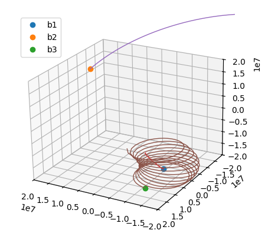

# Physics Simulation: 3-Body Gravitational System

This project simulates the gravitational interaction between three bodies in 3D space using Newton's law of universal gravitation. The simulation visualizes the orbits and trajectories of the bodies using Matplotlib's 3D plotting and animation features.

## Features
- **Three-body simulation**: Models the gravitational forces and resulting motion of three bodies with configurable masses and initial positions.
- **3D Visualization**: Uses Matplotlib to animate the positions and trails of the bodies in three dimensions.
- **Customizable Parameters**: Easily adjust masses, initial positions, and velocities in `main.py`.

## How it Works
- Each body is represented by an instance of the `Body` class, which tracks its position, velocity, and mass.
- At each time step, the gravitational force on each body is calculated from the other bodies.
- The positions and velocities are updated using basic physics equations.
- The simulation is animated, showing the movement and trails of each body.

## Requirements
- Python 3.x
- Matplotlib

Install dependencies with:
```bash
pip install matplotlib
```

## Usage
Run the simulation with:
```bash
python main.py
```
A 3D animation window will appear, showing the orbits and trails of the three bodies.

## Project Structure
```
main.py         # Main simulation and visualization script
img/            # Folder for images
    gravitation1.png  # Example image (see below)
```

## Example Image
Below is an example image from the `img` folder:



---
Feel free to modify the code to experiment with different masses, positions, and velocities!
